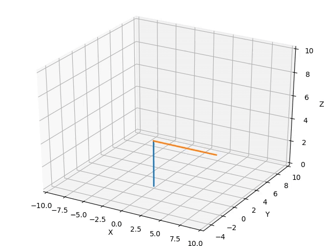
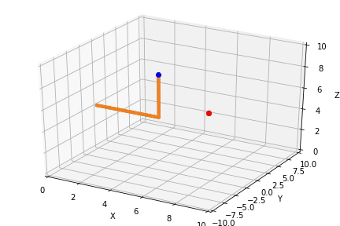
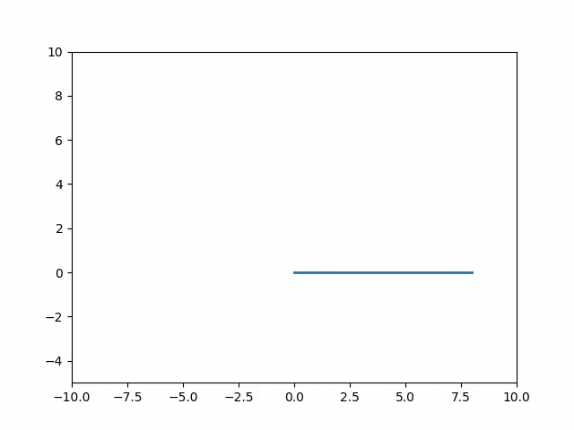
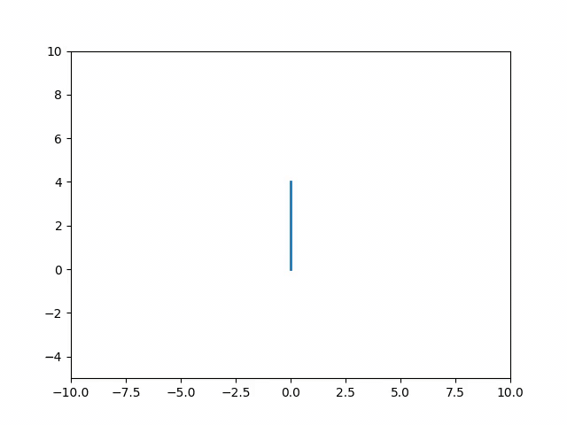
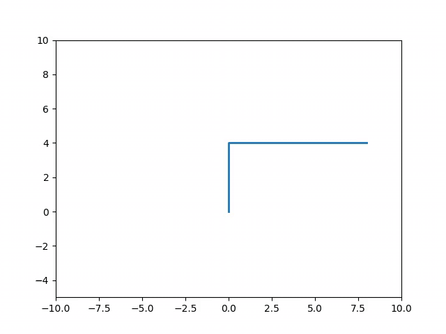

# Manipulator Arm

|Forward Kinematics | Aim was to find end-effector postion in task space with given joint angles. Frame transformation is used to find end-effector postion in terms of joint angles||
|------------------|------------|------------|
| **Inverse Kinematics** |**Aim was to find joint angles requiered to attain end-effector postion in task space. Newton-Raphson Method was used to optimise joint angles. Here orange line is an intial position of an manipulator and red dot is desired position, GIF shows iterations taken to reach desired position** | |

<!-- |XY view | YZ view | XZ view|
|:------:|:--------:|:------:|
|||| -->

